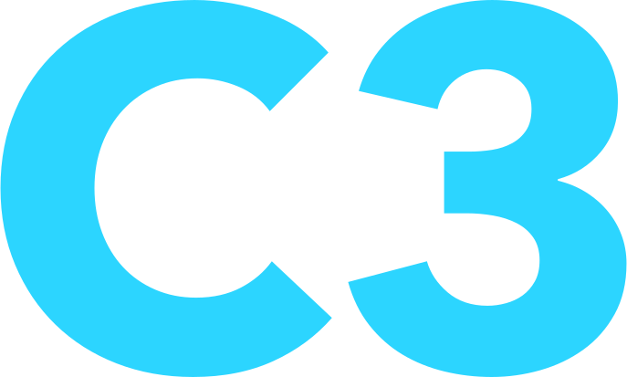

# The C3 Programming Language for highlight.js

## Usage

Load the module after loading highlight.js.  You'll use the minified version found in the `dist` directory. This module is just a CDN build of the language, so it will register itself as the Javascript is loaded.

```html
<script type="text/javascript" src="/path/to/highlight.min.js"></script>
<script type="text/javascript" src="/path/to/c3.min.js"></script>
<script type="text/javascript">
  hljs.highlightAll();
</script>
```

## Links

- The highlight.js GitHub project: <https://github.com/highlightjs/highlight.js>
- Learn more about the C3 programming language: <https://learn-c3.org>
